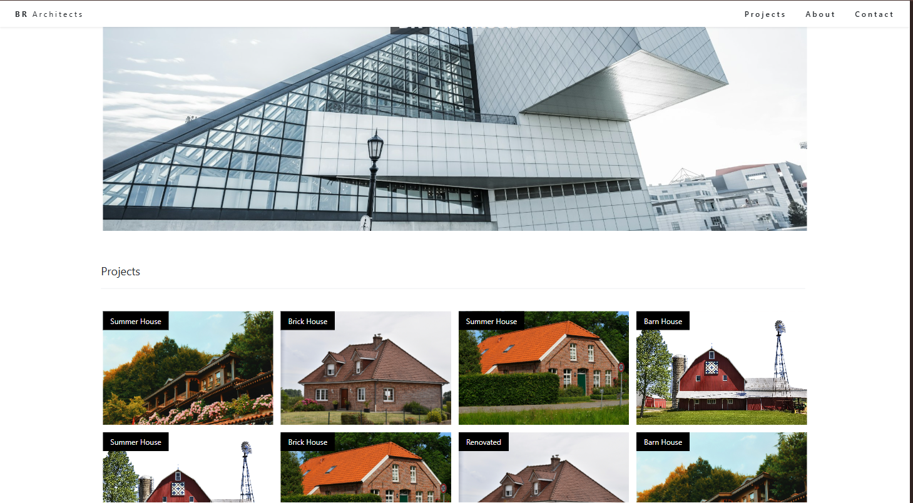
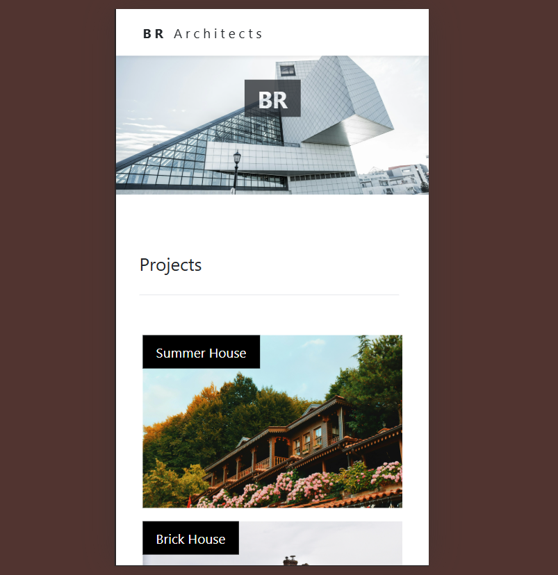

# Template Arsitek

Template website arsitek responsif yang dibuat sebagai proyek pembelajaran, terinspirasi dari template W3.CSS Architect dari W3Schools. Versi ini menggunakan Bootstrap untuk styling dan layout alih-alih W3.CSS, menunjukkan kemampuan adaptasi dan kustomisasi.

## 🚀 Demo Langsung

[Lihat Demo Langsung](https://amanmq-p0.github.io/Architect-Template/)

## 📋 Fitur

- **Desain Responsif**: Dioptimalkan untuk desktop, tablet, dan perangkat mobile menggunakan sistem grid Bootstrap
- **Navigasi Tetap**: Navigasi halus dengan efek hover
- **Bagian Hero**: Header menarik dengan teks overlay pada gambar latar belakang
- **Galeri Proyek**: Layout grid menampilkan proyek arsitektur dengan overlay gambar
- **Bagian Tim**: Kartu anggota tim profesional dengan tombol kontak
- **Formulir Kontak**: Formulir kontak fungsional dengan validasi
- **Footer**: Footer bersih dengan tautan media sosial

## 🛠️ Teknologi yang Digunakan

- **HTML5**: Markup semantik untuk aksesibilitas dan SEO yang lebih baik
- **CSS3**: Styling kustom dengan framework Bootstrap
- **Bootstrap 5.3.8**: Framework responsif untuk layout dan komponen
- **Bootstrap Icons**: Pustaka ikon untuk elemen visual

## 📁 Struktur Proyek

```
architect-template/
├── index.html          # File HTML utama
├── css/
│   └── app.css         # Styling kustom
├── img/                # Aset gambar
│   ├── img-header.jpg
│   ├── img-projeck1.jpg
│   ├── img-projeck2.jpg
│   ├── img-projeck3.jpg
│   ├── img-projeck4.jpg
│   ├── img-about1.png
│   └── img-location1.jpg
└── README.md           # Dokumentasi proyek
```

## 🚀 Memulai

### Prasyarat

- Browser web modern (Chrome, Firefox, Safari, Edge)
- Tidak memerlukan perangkat lunak tambahan - ini adalah website statis

### Instalasi

1. **Kloning repository**

   ```bash
   git clone https://github.com/AmanMQ-P0/Architect-Template.git
   ```

2. **Navigasi ke direktori proyek**

   ```bash
   cd architect-template
   ```

3. **Buka di browser**

   - Buka `index.html` langsung di browser web Anda
   - Atau gunakan server lokal untuk pengalaman development yang lebih baik:

     ```bash
     # Menggunakan Python (jika terinstal)
     python -m http.server 8000

     # Menggunakan Node.js (jika terinstal)
     npx serve .
     ```

4. **Lihat website**
   - Buka `http://localhost:8000` (atau port pilihan Anda) di browser

## 📸 Screenshot

### Tampilan Desktop



### Tampilan Mobile



## 🎨 Kustomisasi

### Warna

- Primer: Hitam (#000000)
- Sekunder: Putih (#FFFFFF)
- Aksen: Warna default Bootstrap

### Font

- Font default Bootstrap (font sistem untuk performa yang lebih baik)

### Gambar

Ganti gambar di folder `img/` dengan gambar Anda sendiri:

- `img-header.jpg`: Latar belakang bagian hero
- `img-projeck*.jpg`: Gambar showcase proyek
- `img-about1.png`: Foto anggota tim
- `img-location1.jpg`: Gambar lokasi/peta

## 📚 Catatan Pembelajaran

Proyek ini dibuat sebagai latihan pembelajaran untuk:

- Berlatih desain web responsif dengan Bootstrap
- Mengadaptasi template yang ada ke framework berbeda
- Mengimplementasikan struktur HTML semantik
- Menambahkan CSS kustom untuk styling yang ditingkatkan
- Memastikan kompatibilitas lintas browser

## 🙏 Kredit

- **Template Asli**: Terinspirasi dari [Template Arsitek W3Schools](https://www.w3schools.com/w3css/tryw3css_templates_architect.htm)
- **Framework**: [Bootstrap](https://getbootstrap.com/)
- **Ikon**: [Bootstrap Icons](https://icons.getbootstrap.com/)

## 📄 Lisensi

Proyek ini dilisensikan di bawah Lisensi MIT - lihat file [LICENSE](LICENSE) untuk detail.

## 👤 Penulis

**Aman MQ_P0**

- GitHub: [AmanMQ-P0](https://github.com/AmanMQ-P0)

---

⭐ Jika proyek ini membantu, berikan bintang!

---

_Catatan: Ini adalah proyek pembelajaran. Untuk penggunaan produksi, pertimbangkan menambahkan fungsionalitas backend untuk formulir kontak dan mengoptimalkan gambar untuk performa web._
